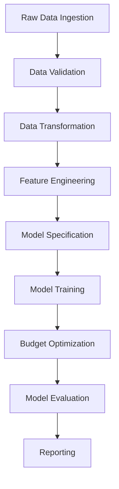

# Hierarchical Bayesian Marketing Mix Modeling (MMM) System

[](https://www.python.org/downloads/)
[](https://github.com/google/meridian)
[](https://github.com/astral-sh/uv)

A production-grade, digital-first Marketing Mix Modeling system built with Hierarchical Bayesian modeling using **Google Meridian** as the primary backend and **PyMC** as a first-class fallback option.

---

## 📚 Workflow Overview

This MMM system follows a modular, config-driven pipeline for robust media mix modeling and optimization. Each step is mapped to a script/module and YAML config section.

### Workflow Diagram



---

## 🛠 Step-by-Step Pipeline & Scripts

### 1. Data Ingestion
- **Script:** `src/mmm/data/ingest.py`
- **Config:** `ingest` section
- **Purpose:** Loads raw data from sources (Figshare, CSV, etc.)
- **Status:** Should exist and support all connectors in config

### 2. Data Validation
- **Script:** `src/mmm/data/validate.py`
- **Config:** `validation` section
- **Purpose:** Checks schema, coverage, identifiability, value sanity, duplicates, quality thresholds
- **Status:** Should exist; ensure all config rules are implemented

### 3. Data Transformation  --- already included the cleaning stage into data validation
- **Script:** `src/mmm/data/transform.py`
- **Config:** `enhanced_cleaning`, `data` sections
- **Purpose:** Harmonizes, aggregates, applies cleaning, prepares for feature engineering
- **Status:** Exists; confirm all config-driven cleaning steps are implemented

### 4. Feature Engineering
- **Scripts:** `src/mmm/features/adstock.py`, `saturation.py`, `attribution.py`, `baseline.py`, `seasonality.py`, `custom_terms.py`
- **Config:** `features` section
- **Purpose:** Applies adstock, saturation, attribution, seasonality, baseline, and custom business logic
- **Status:** Modules exist; orchestration (calling all feature steps in order) may be missing

### 5. Model Specification
- **Scripts:** `src/mmm/models/meridian.py`, `pymc.py`, `base.py`
- **Config:** `model` section
- **Purpose:** Defines model structure, priors, constraints, backend selection
- **Status:** Exists; ensure all config options are used in model initialization

### 6. Model Training
- **Script:** `src/mmm/cli.py` (calls model training), possibly a dedicated `train.py`
- **Config:** `training` section
- **Purpose:** Trains the model, supports cross-validation, seeds, runtime guardrails, checkpointing
- **Status:** CLI orchestrates training; advanced features may need to be implemented

### 7. Budget Optimization
- **Script:** `src/mmm/optimization/allocator.py`
- **Config:** `optimization` section
- **Purpose:** Optimizes marketing spend allocation
- **Status:** Exists; ensure logic matches config

### 8. Model Evaluation
- **Script:** `src/mmm/evaluation/validator.py`
- **Config:** `evaluation` section
- **Purpose:** Assesses model quality and performance
- **Status:** Exists; ensure metrics and validation strategies are implemented

### 9. Reporting
- **Script:** `src/mmm/reporting/dashboard.py`
- **Config:** `reports` section
- **Purpose:** Generates reports and dashboards
- **Status:** Exists; ensure outputs match config

---

## � Configuration System

- **YAML-based:** All pipeline steps, parameters, and business rules are defined in `config/main.yaml`
- **Profiles:** Supports local, docker, k8s, and custom profiles for environment-specific settings
- **Validation:** Type-safe config with automatic validation

---

## 📦 Script Reference

| Script/Module                | Purpose                                                      |
|------------------------------|--------------------------------------------------------------|
| `cli.py`                     | Orchestrates pipeline steps via CLI                          |
| `data/ingest.py`             | Loads raw data from sources                                  |
| `data/validate.py`           | Validates data quality, schema, coverage                     |
| `data/transform.py`          | Cleans, harmonizes, aggregates, prepares for features        |
| `features/*.py`              | Feature engineering: adstock, saturation, attribution, etc.  |
| `models/meridian.py`         | Meridian backend model implementation                        |
| `models/pymc.py`             | PyMC backend (in progress)                                   |
| `optimization/allocator.py`  | Budget optimization logic                                    |
| `evaluation/validator.py`    | Model evaluation and diagnostics                             |
| `reporting/dashboard.py`     | Reporting and dashboard generation                           |
| `utils/logging.py`           | Structured logging and run tracking                          |

---

## 🚦 Current Project Status

### ✅ Implemented
- Project structure and config system
- Data ingestion, validation, transformation scripts
- Feature engineering modules (adstock, saturation, etc.)
- Meridian backend model
- CLI orchestration
- Structured logging

### 🟡 In Progress / Needs Work
- Feature engineering orchestration (call all feature steps in order)
- Advanced config-driven cleaning/validation (campaign-aware imputation, adjustment columns, smart aggregation)
- PyMC backend implementation
- MLflow experiment tracking
- Model training: advanced features (rolling splits, runtime guardrails, checkpointing)
- Model evaluation: full metrics, diagnostics, validation strategies
- Reporting: ensure outputs match config
- Unit/integration tests for all steps

### 🔜 Next Steps
```
- [ ] Create/expand feature engineering orchestration script/function
- [ ] Expand transform.py and validate.py for advanced config-driven cleaning/validation
- [ ] Implement PyMC backend
- [ ] Add MLflow experiment tracking
- [ ] Add advanced training features (cross-validation, checkpointing)
- [ ] Expand model evaluation and reporting
- [ ] Add unit/integration tests for robustness
```

---

## 🧭 Roadmap

### Phase 1: Core Infrastructure ✅
- [x] Project structure and configuration
- [x] Data pipeline (ingest, validate, transform)
- [x] Google Meridian integration
- [x] CLI interface
- [x] Structured logging

### Phase 2: Advanced Modeling (In Progress)
- [ ] PyMC backend implementation
- [ ] MLflow experiment tracking
- [ ] Advanced diagnostics and validation
- [ ] Media saturation curves
- [ ] Carryover effects modeling

### Phase 3: Production Features (Planned)
- [ ] Real-time prediction API
- [ ] Interactive dashboard
- [ ] A/B testing framework
- [ ] Automated retraining
- [ ] Multi-geo modeling

---

## 🛡 Data Privacy & Security

- Sensitive data masking in logs
- No PII in log outputs
- Environment-based secret management

---

## 📚 Dependencies

### Core
- google-meridian
- tensorflow
- tensorflow-probability
- pandas
- numpy
- pydantic
- click

### Development
- pytest
- black
- isort
- mypy

---

## � Testing

The project includes a comprehensive testing suite organized in the `tests/` directory:

### Test Structure
```
tests/
├── unit/                          # Unit tests for individual components
│   ├── test_config_usage_validation.py    # Config validation tests
│   └── test_config_specific_validation.py # Domain-specific config tests
├── integration/                   # End-to-end integration tests
│   └── test_pipeline.py          # Complete pipeline test
└── validation/                    # Config validation utilities
    ├── validate_config_usage.py  # Config usage validation runner
    └── analyze_config_validation.py # Validation analysis and reporting
```

### Running Tests

#### Quick Test Commands
```bash
# Run all tests
python run_tests.py all

# Run specific test types
python run_tests.py config     # Configuration validation
python run_tests.py unit       # Unit tests only
python run_tests.py integration # Integration tests only
python run_tests.py pipeline   # End-to-end pipeline test

# Run with verbose output
python run_tests.py all --verbose
```

#### Direct Test Execution
```bash
# Config validation with detailed report
python tests/validation/validate_config_usage.py

# End-to-end pipeline test
python tests/integration/test_pipeline.py --profile local

# Unit tests with pytest
pytest tests/unit/ -v

# Integration tests with pytest
pytest tests/integration/ -v
```

### Test Features

- **Config Validation**: 100% validation of all config variables with usage tracking
- **Pipeline Testing**: Complete end-to-end workflow validation
- **Automated Reporting**: Detailed test reports and actionable recommendations
- **CI/CD Integration**: Ready for automated testing pipelines

---

## �🤝 Contributing

1. Fork the repository
2. Create feature branch (`git checkout -b feature/amazing-feature`)
3. Commit changes (`git commit -m 'Add amazing feature'`)
4. Push to branch (`git push origin feature/amazing-feature`)
5. Open Pull Request

